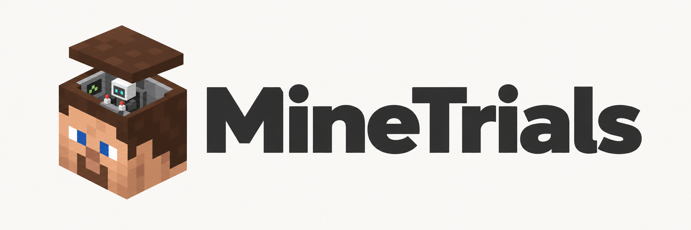
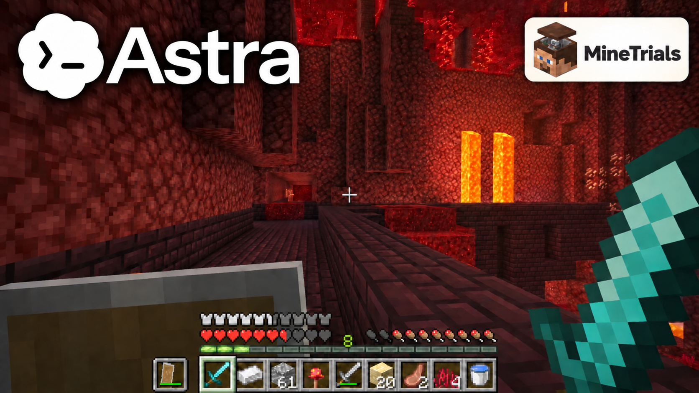
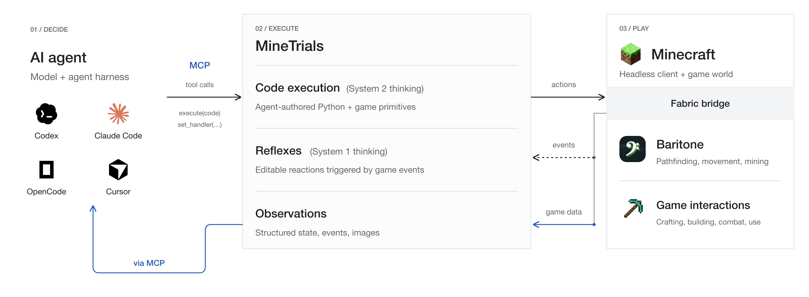

# MineTrials

<p align="center">
  
</p>

### [Read the blog post →](https://massiminoe.github.io/minetrials/)

How far can an AI agent get in an hour of Minecraft? **MineTrials** tests models
and coding harnesses in a fresh survival world, counting the advancements they
earn along the way—from crafting a workbench to entering the Nether.

[🤗 Explore the dataset on Hugging Face](https://huggingface.co/datasets/mxls/MineTrials)

The repo includes everything needed to run a trial with Codex, Claude Code,
Cursor, or OpenCode. Each agent brings its own reasoning loop; MineTrials
provides the Minecraft world and tools to play in it. Runs capture advancements,
transcripts, gameplay video, and usage data where available. The Hugging Face
dataset contains the non-video artifacts.

<a href="https://youtu.be/ntVf2DUeaBg"> Watch Astra’s best run</a>

[](https://youtu.be/ntVf2DUeaBg)

## How an agent plays Minecraft

[](site/assets/harness.svg)

The agent supplies the reasoning loop; MineTrials supplies the game interface.
Event-driven reflexes react between model calls. See the
[runtime reference](RUNTIME.md) for the tools and bridge API.

## Run the benchmark

You need Git, Python 3.13, and Docker Engine/Desktop with Compose. The runner
builds the Minecraft environment, runtime, and selected harness in containers;
Java, Gradle, and Node.js are not required on the host for a benchmark run.
The Compose configuration accepts the Minecraft EULA for the server.

```bash
git clone https://github.com/massiminoe/minetrials.git
cd minetrials
```

Configure credentials for your chosen harness in the environment or a local
`.env` file; see [harness authentication](bench/README.md#auth) and the
[Codex setup](bench/README.md). Then run a trial, for example:

```bash
bench/run.sh --harness claude-code --model claude-haiku-4-5-20251001 --seconds 3600
```

On Apple Silicon, add `--local` to use the native arm64 client. Start with
`--seconds 600` for a short pilot before a full run. The runner creates a fresh
world, starts the harness after the bot is ready, collects artifacts under
`state/bench/<run-id>/`, and tears down the trial stack.

The primary metric is **advancement count**: each advancement counts once.
Historical `score.json` files use the final ledger, which can include events
after the deadline; the release derives a separate strict in-budget score.
Read the [methodology and score boundaries](bench/README.md#methodology-and-score-boundaries)
for game rules, timing, exclusions, and reproducibility limits. For sweeps,
AWS runs, additional harnesses, and analysis, see the [benchmark guide](bench/README.md).

## Develop the runtime or connect an agent manually

For interactive development, install the Python runtime and browser monitor
from the repository root. Node.js 22.12+ is required for the monitor.

```bash
python3.13 -m venv .venv
.venv/bin/python -m pip install -c requirements-dev.lock -e '.[dev]'
cd frontend && npm ci && cd ..
```

Run these in separate terminals from the repository root:

```bash
# Minecraft server + headless client + bridge
docker compose up --build

# Python runtime: MCP on 5556, monitor on 5555
make run

# Monitor development server on 5173
make frontend
```

Open [the monitor](http://localhost:5173). The first world/client startup can
take several minutes. The monitor shows video, actions, events, and inventory;
actions come from the connected MCP agent.

Connect your agent to `http://127.0.0.1:5556/mcp` and give it the
[Minecraft driving skill](skills/minetrials/SKILL.md). For Claude Code:

```bash
claude mcp add --transport http minetrials http://127.0.0.1:5556/mcp
```

The runtime requires no provider credentials. Your external agent or benchmark
harness authenticates separately. Optional runtime settings are documented in
[.env.example](.env.example); copy it to `.env` if you need overrides.

On Apple Silicon, the default client runs under amd64 emulation. `make up-arm`
uses the separate native arm64 build. Benchmark comparisons should record which
platform was used.

These services are intended for a trusted development environment. The bridge
and monitor have no authentication, and the bundled Minecraft server uses
offline mode. Keep their ports on a trusted network.

## Benchmark environment

The agent calls MCP tools to inspect the world, take screenshots, and execute
short Python actions in the runtime's restricted primitive environment. The
native bridge performs Minecraft operations on the client tick thread.
Baritone assists navigation and mining; this is a structured-tool benchmark,
not a keyboard-and-mouse-only benchmark. One shared runtime enforces a single
bridge-driving action at a time and supplies hazard reflexes.

The normal development world is peaceful. The benchmark overlay uses normal
difficulty, a fixed seed, and modified game rules including `keepInventory`.
See [benchmark methodology](bench/README.md#methodology-and-score-boundaries)
before interpreting scores.

## Development and checks

```bash
make test             # unit tests; no Minecraft stack
make frontend-build   # TypeScript check + production build
make skill-docs       # regenerate primitive, event, and tool documentation
make run-mock         # runtime with mock bridge; no Minecraft needed
```

After `make frontend-build`, the runtime serves the monitor at
[localhost:5555](http://localhost:5555) without the Vite development server.
`make test-e2e` builds a temporary Docker project, crafts through MCP, checks
the monitor and screenshot, then removes only its own containers and volumes.
It needs Docker Compose 2.24.4+ and no model credentials. On Apple Silicon it
uses the native arm64 client. Diagnostic logs are kept under `state/e2e/`. `docker compose down` stops the development stack;
`docker compose down -v` also removes its named volumes.

## Naming and migration

The project, Python package, CLI, MCP service, and agent skill are named
`minetrials` (MineTrials in prose). Reinstall the Python package and rebuild
containers when updating an existing checkout. Update MCP connection names,
skill paths, and runtime environment overrides to `MINETRIALS_*`. The default
Minecraft player is now `MineTrials`, with a matching offline operator UUID;
existing worlds will treat it as a new player.

The original seed `mineclaude-bench-1`, deployed AWS resource/profile names,
and historical evidence retain their recorded values. Changing the seed would
change the benchmark world; renaming cloud resources requires a separate migration.

## Repository guide

- [bench/](bench/README.md): run orchestration, AWS sweeps, scoring, and analysis.
- [minetrials/](minetrials/): Python runtime, MCP server, monitor, and sandbox.
- [mc-mod/](mc-mod/): Kotlin/Fabric native bridge.
- [mc-client/](mc-client/): headless client images and startup scripts.
- [frontend/](frontend/README.md): React monitor.
- [skills/minetrials/](skills/minetrials/SKILL.md): agent-facing driving instructions.
- [RUNTIME.md](RUNTIME.md): detailed bridge API and operational gotchas.
- [RELEASING.md](RELEASING.md): release preparation and reproducibility checks.
- [THIRD_PARTY.md](THIRD_PARTY.md): dependency and asset provenance.

Run artifacts, credentials, and session state belong under ignored local paths,
not in Git. The code release and benchmark dataset are separate deliverables.

## License

MineTrials' original code is available under the [MIT License](LICENSE).
Third-party code and assets retain their own terms; see [THIRD_PARTY.md](THIRD_PARTY.md).
The code license does not cover Minecraft assets or the separately published
benchmark dataset and gameplay recordings.
